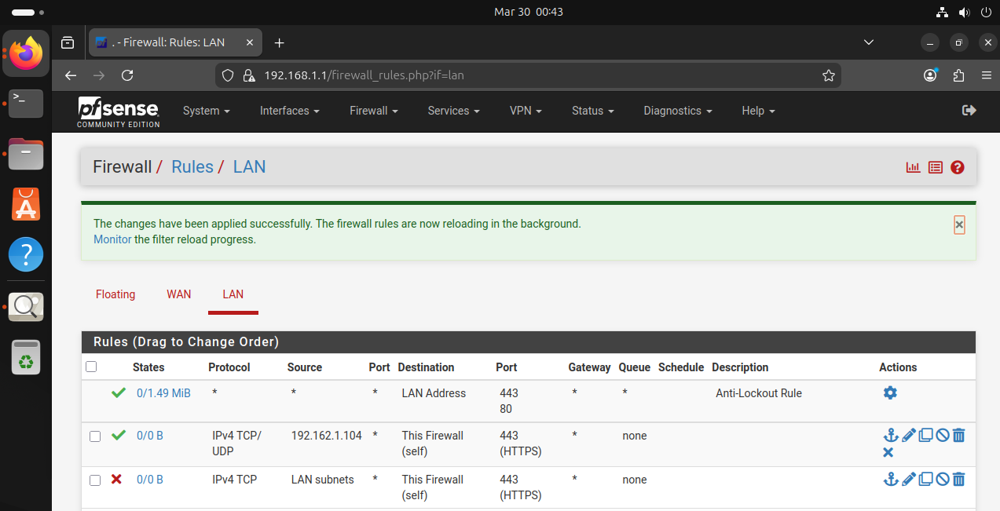
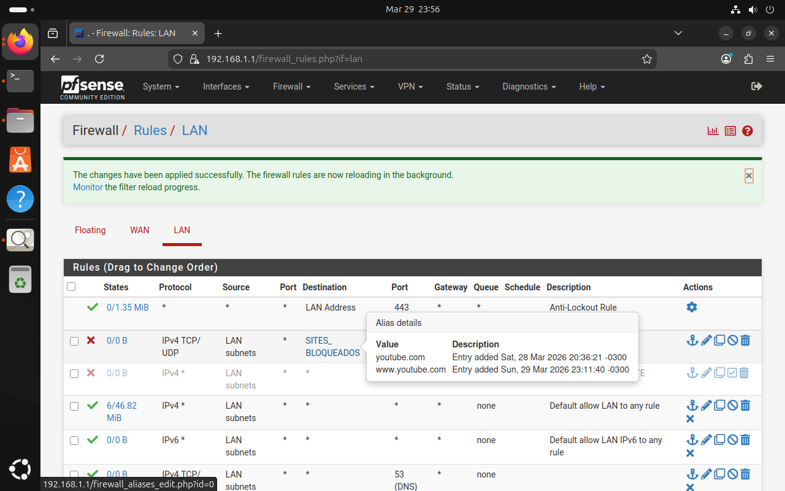
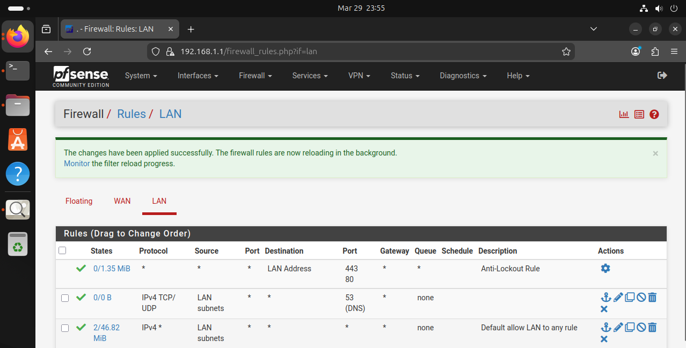
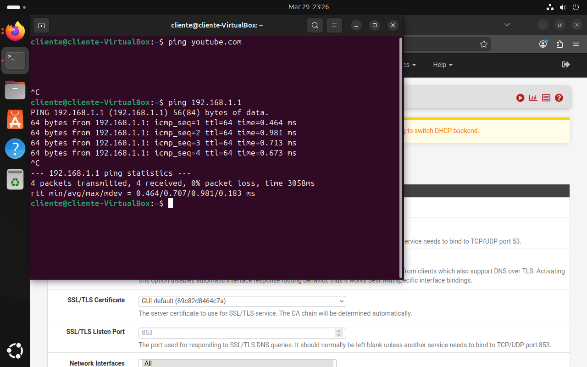
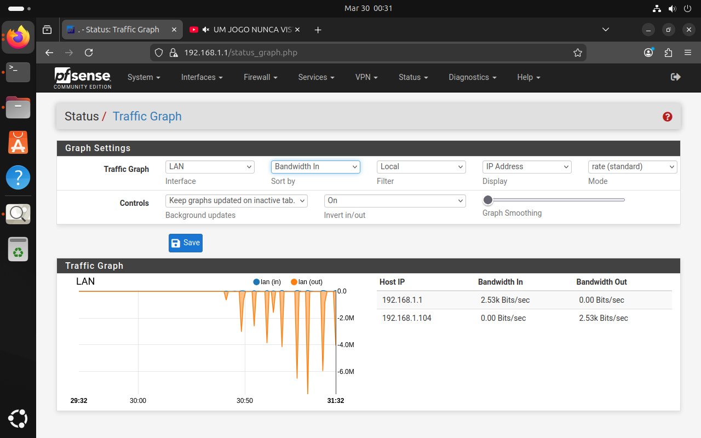
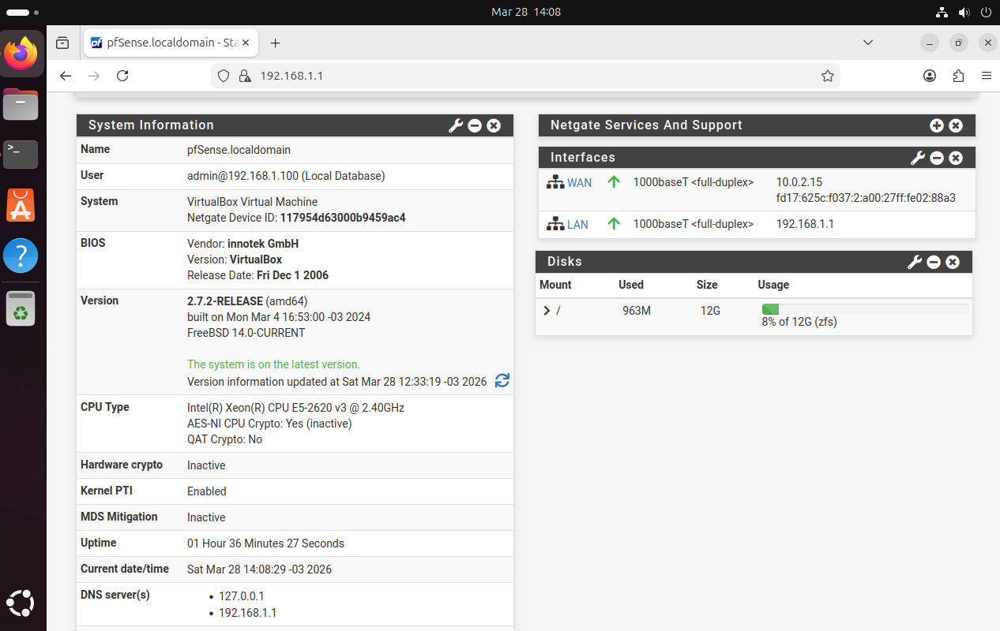
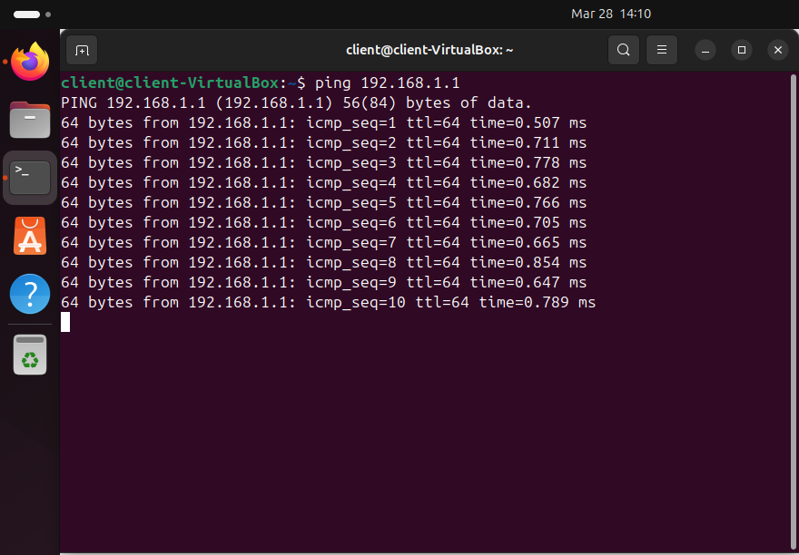
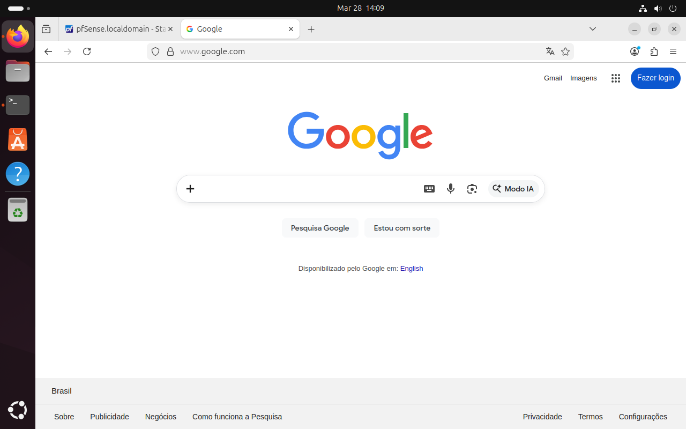

# 🔥 pfSense Firewall Lab

## 📌 Sobre o Projeto
Laboratório prático de firewall desenvolvido enquanto finalizo a certificação **FCA Fortinet**.  
Como ainda não consegui subir o FortiGate no ambiente virtual, utilizei o **pfSense** para colocar em prática os conceitos de firewall, regras de filtragem e controle de tráfego.

Objetivo: simular um ambiente corporativo real com firewall entre cliente interno e internet.

---

## 🛠️ Tecnologias Utilizadas
- **pfSense** (versão Community Edition)
- **Ubuntu 22.04 LTS** (cliente)
- **Oracle VM VirtualBox**
- Redes: NAT (WAN) + Host-Only (LAN)

---

## 🧱 Arquitetura da Rede

*Internet ←→ [WAN - NAT] pfSense Firewall [LAN - Host-Only] ←→ Ubuntu Client*

- **pfSense LAN**: 192.168.1.1/24
- **DHCP**: Ativo (pool 192.168.1.100-200)

---

## 🚀 Como Configurar (Passo a Passo)

1. Importe a OVA do pfSense no VirtualBox
2. Crie 2 interfaces:
   - **WAN** → NAT
   - **LAN** → Host-Only Adapter
3. Instale e configure o pfSense via console (IP LAN: 192.168.1.1)
4. No Ubuntu:
   - Adaptador em Host-Only
   - Obtenha IP via DHCP
5. Acesse o dashboard do pfSense em `https://192.168.1.1`

---

## 🔐 Regras de Firewall Implementadas

### 1. Restrição de Acesso ao Painel do pfSense
- Regra aplicada na interface LAN
- Acesso ao GUI permitido **apenas** de IP específico (Ubuntu Client)

### 2. Bloqueio de Site Específico (YouTube)
- Regra de bloqueio por URL/DNS
- Teste: tentativa de acesso ao YouTube foi negada

### 3. Bloqueio Completo da Porta 53 (DNS)
- Regra de bloqueio de tráfego outbound na porta 53
- Teste: ping e resolução de DNS falharam conforme esperado

### 4. Monitoramento de Tráfego
- Gráfico de tráfego em tempo real no pfSense

---

## 📸 Demonstração

**Dashboard pfSense**  

**Teste de Ping com Sucesso (antes das regras)**  

**Acesso à Internet via Firewall**  

## 🛠️ Problemas Encontrados e Soluções

Durante a montagem deste lab enfrentei vários desafios reais de configuração de firewall. Abaixo estão os principais problemas que resolvi:

- **Falta de conectividade inicial**  
  O cliente não conseguia se comunicar com a rede.  
  **Solução:** Ajuste completo das interfaces de rede, configuração do DHCP e definição correta do gateway no pfSense.

- **DNS não funcionando**  
  Não era possível acessar nenhum site (ex: Google).  
  **Solução:** Configuração manual dos servidores DNS no pfSense e ajuste no sistema do cliente.

- **Bloqueio total de navegação após criação de regras**  
  Nenhum site abria depois de aplicar as regras de firewall.  
  **Solução:** Identifiquei que a regra estava bloqueando a porta 53 (DNS) sem exceção. Corrigi a ordem e a lógica das regras, liberando o DNS necessário.

- **Bypass de DNS pelo cliente**  
  O bloqueio do YouTube era contornado porque o cliente usava DNS externo.  
  **Solução:** Forcei o uso do DNS do pfSense editando o `resolv.conf` no Ubuntu.

- **DNS quebrado no próprio pfSense**  
  Nem o firewall conseguia resolver domínios.  
  **Solução:** Correção manual via terminal no pfSense (ajuste do Unbound e resolv.conf).

- **Falta de visibilidade do tráfego**  
  Dificuldade para validar se as regras estavam funcionando corretamente.  
  **Solução:** Utilizei o **Traffic Graph** do pfSense para monitorar o tráfego em tempo real.

---

**Aprendizado principal:**  
Esses problemas me mostraram na prática que configurar firewall vai muito além de criar regras — é preciso entender ordem de regras, exceções, prevenção de bypass e fazer testes constantes. Documentar e resolver esses incidentes foi uma das partes mais valiosas do lab.

---

## 🧪 Testes Realizados
- ✅ Comunicação cliente ↔ firewall
- ✅ Navegação na internet através do pfSense
- ✅ Ping e DNS funcionando (antes das regras)
- ✅ Bloqueio de site específico (YouTube)
- ✅ Bloqueio total de DNS (porta 53)
- ✅ Restrição de acesso ao painel do pfSense
- ✅ Monitoramento de tráfego

---

## 🧠 Aprendizados
- Configuração avançada de regras de firewall no pfSense
- Diferença prática entre NAT e Host-Only
- Uso de alias, schedules e floating rules
- Troubleshooting de conectividade e bloqueios
- Importância de restringir acesso ao próprio firewall

---

## 🔜 Próximos Passos
- Implementar regras mais granulares (categorias de sites, portas específicas)
- Adicionar VPN (OpenVPN/WireGuard)
- Configurar Suricata ou Snort (IDS/IPS)
- Migrar o lab para Proxmox + automação (Terraform/Ansible)

---

## 👨‍💻 Autor
**Christyan Marques**  
Estudante de Cybersecurity | Finalizando FCA Fortinet | Construindo labs práticos

---

**Repo:** [pfsense-lab-firewall](https://github.com/ChristyanMarques/pfsense-lab-firewall)